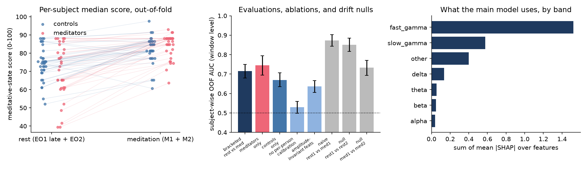

# meditation-state-scoring


-orange)


**A meditative-state score from EEG, on a 70-subject cohort I collected, using the same
production pipeline as [eeg-cognitive-scoring](https://github.com/ankanbiswas022/eeg-cognitive-scoring).**

The public cognitive-scoring repo was built on a public dataset. This repo points the same
feature extractor, per-person calibration, subject-wise validation and calibrated scorer at
the 64-channel EEG cohort behind
[Biswas et al. 2026, *Imaging Neuroscience*](https://doi.org/10.1162/IMAG.a.1145)
(34 long-term open-eyed meditators, 36 controls after QC). Participant EEG is under IISc ethics
approval and is **not** in this repository; the loader reads it from a path set by
`MEDSCORE_DATA`. Code, configuration, aggregate metrics and figures are public.

<p align="center"></p>

## The scoring problem

Each session contains 5 min of eyes-open rest (EO1), 15 min of open-eyed meditation (M1),
and then both again (EO2, M2). Eye state is therefore matched between rest and meditation,
so a classifier cannot cheat on alpha. The first 40 % of EO1 is the person's **calibration
segment**; every feature of every later window is z-scored against it. Scored windows are
the rest of EO1 plus EO2 (label 0) and M1 plus M2 (label 1): 2.5-s trials, bad trials
removed by the published QC, bad electrodes carried as missing values.

## Results (subject-wise 6-fold CV, 70 subjects, 49 590 windows)

| evaluation | window AUC [95 % CI] | recording AUC | what it tells you |
|---|---|---|---|
| **Bracketed rest vs meditation** (main) | **0.715** [0.680, 0.749] | **0.80** | the honest state signal |
| same model scored on meditators / controls | 0.76 / 0.67 | | state is more separable in experts |
| fitted within meditators only | 0.745 [0.695, 0.795] | 0.83 | |
| fitted within controls only | 0.669 [0.636, 0.707] | 0.77 | |
| ablation: no per-person calibration | 0.529 [0.498, 0.559] | 0.54 | calibration is essential |
| ablation: amplitude-invariant features only | 0.636 [0.606, 0.666] | 0.72 | the signal is largely gamma *power* |
| naive: rest1 vs med1 | 0.873 [0.843, 0.903] | 0.93 | the number you would report without a control |
| null: rest1 vs rest2 (both rest) | 0.851 [0.816, 0.885] | 0.91 | drift alone gives 0.85; the naive result is mostly drift |
| null: med1 vs med2 (both meditation) | 0.734 [0.692, 0.771] | 0.81 | |

**Trait check.** Per-subject (meditation − rest) score delta: meditators 12.9 vs controls
9.1 points, Mann–Whitney p = 0.024; the delta separates the groups with AUC 0.66. SHAP is
dominated by fast-gamma (36–66 Hz) and slow-gamma (20–35 Hz) log power at parieto-occipital
(POz, PO4, P2, P7) and temporal (TP7, TP9, TP10, AF8) sites, which matches the published
finding (occipital narrowband plus fronto-temporal broadband gamma in meditators) and
carries the same EMG caveat: temporal broadband gamma can be muscle.

**What happened, in order.** The first design (rest early in the session vs meditation
later) gave AUC 0.87. The drift null gave 0.85 on two blocks that are both rest, and
calibrate-once transfer to the second half of the session was near chance. The model was
learning time since calibration, not state. Bracketing meditation with rest recorded both
before and after removes monotonic drift as a label proxy; the state signal that survives is
0.72 at the window level and 0.80 per recording, higher in long-term meditators than in
controls who were meditating for the first time. That is the number this repo reports.

## Controls that make the number credible

* **Absolute-feature ablation**: the same model without per-person calibration.
* **Bracketed design**: rest is taken both before and after meditation, so a model cannot
  use monotonic time-since-calibration drift as a proxy for the label.
* **Time-on-task nulls**: rest1 vs rest2 and med1 vs med2 with the identical pipeline. If
  these are separable, the model is learning drift (gel drying, fatigue), not state.
* **Trait check against the paper**: the per-subject median meditation score should be
  higher in long-term meditators than controls, and the SHAP band profile should match the
  published effect (occipital narrowband and fronto-temporal broadband gamma). If the model
  leans on temporal broadband gamma, EMG is on the table and is said so.

## Reproduce (with data access)

```bash
pip install -e ".[dev]"                 # pulls eegscore from GitHub
set MEDSCORE_DATA=D:\path\to\BK1        # folder containing data/segmentedData
python -m medscore.extract --workers 4  # per-trial features -> cache/*.parquet (~45 min)
python -m medscore.train                # all evaluations -> reports/metrics.json
python -m medscore.figure
pytest -q                               # synthetic tests, no data needed
```

## Author

Ankan Biswas — PhD (Neuroscience), IISc Bengaluru. ankanbiswas0804@gmail.com ·
[Google Scholar](https://scholar.google.com/citations?user=oG28KRIAAAAJ) ·
[LinkedIn](https://www.linkedin.com/in/ankan-biswas-45357685/)
